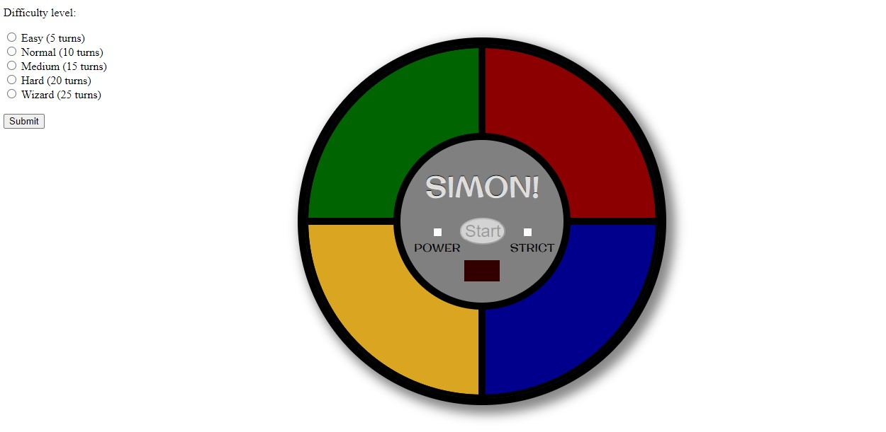

# Simon Game

> Simon Game build with JavaScript, HTML and CSS 👻

# Live demo

>



## Table of contents

- [General info](#general-info)
- [Setup](#setup)
- [Code Examples](#code-examples)
- [Features](#features)
- [Contact](#contact)

## General info

I was looking for fun projects to improve my JavaScript skills, and I stumbled with this video from freecodecamp.org:

https://www.youtube.com/watch?v=n_ec3eowFLQ&t=121s

And I thought, I've got two options, I can watch the tutorial or try to build own my own. 🤔

I decided for the latest option, grabbed the HTML and CSS and start building it from scratch, and here is the result! 😀

The project is not quite responsive, only JavaScript involved.

## Code Examples

./js/index.js

```
function startGame() {
  let i = 0;
  while (i < difficultyLevel) {
    i++;
    const side = randomSide(sides);
    const sideNumber = Number(side.dataset.side);
    const audioNumber = audios[sideNumber - 1];
    computerRegister.push({
      side: sideNumber,
      audio: audioNumber,
      element: side,
    });
  }

  computerSequence(
    computerRegister,
    computerTurn,
    sides,
    strict.checked ? 'strict' : 'normal',
    strict.checked ? attempts.strict : attempts.normal
  );
}
```

## Features

The project is created with:

- JavaScript
- HTML && CSS

## Contact

Created by Cudi - feel free to contact me!
